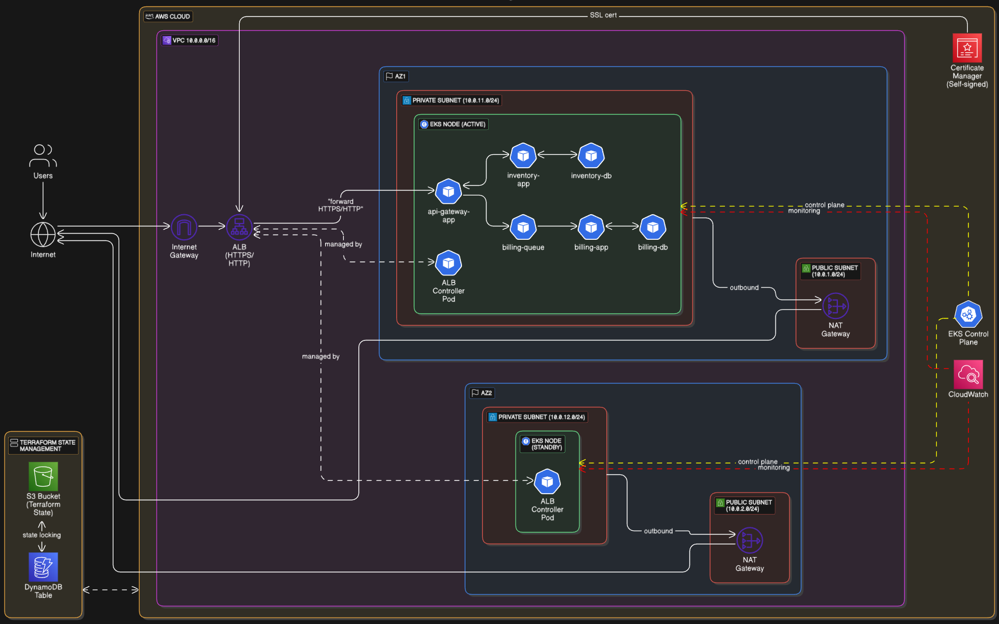
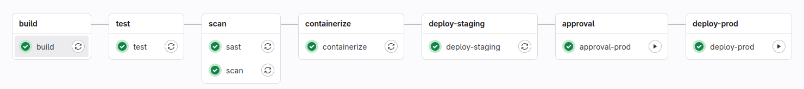
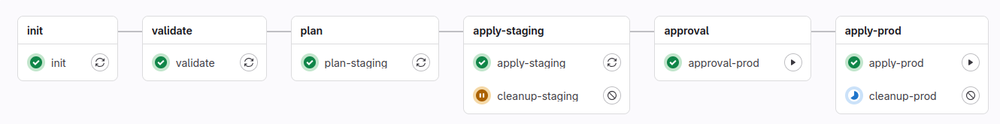
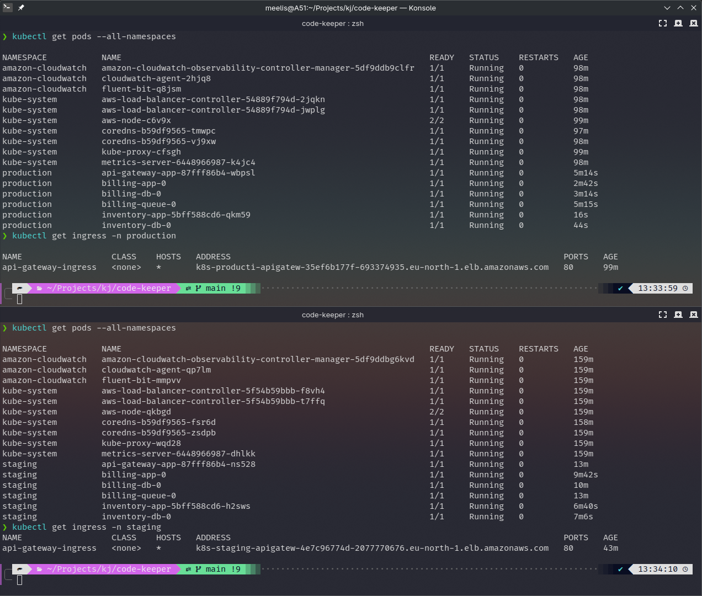
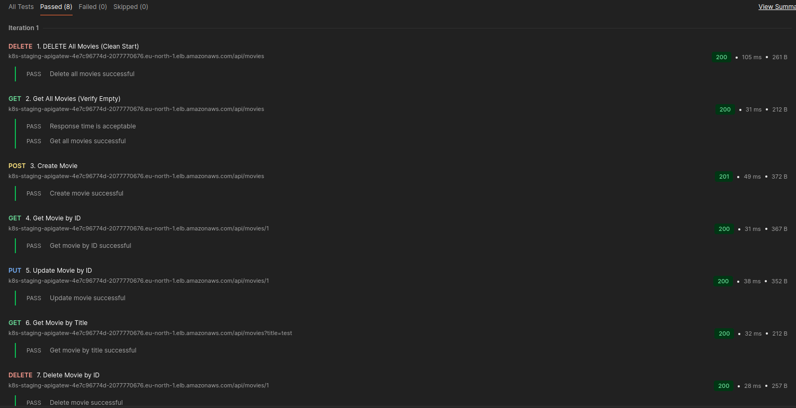
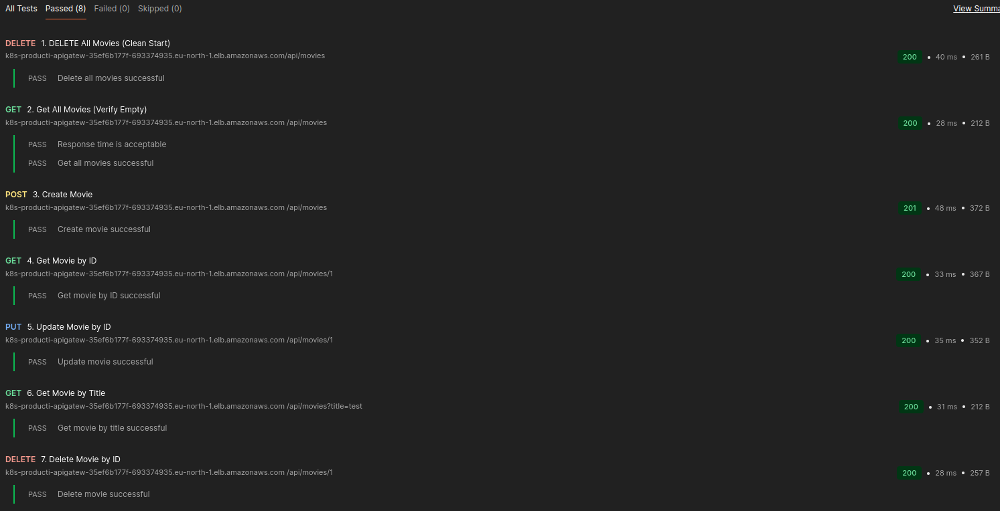
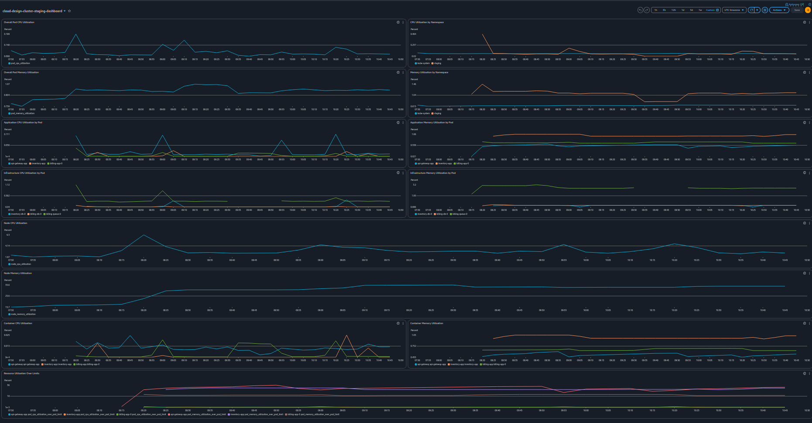
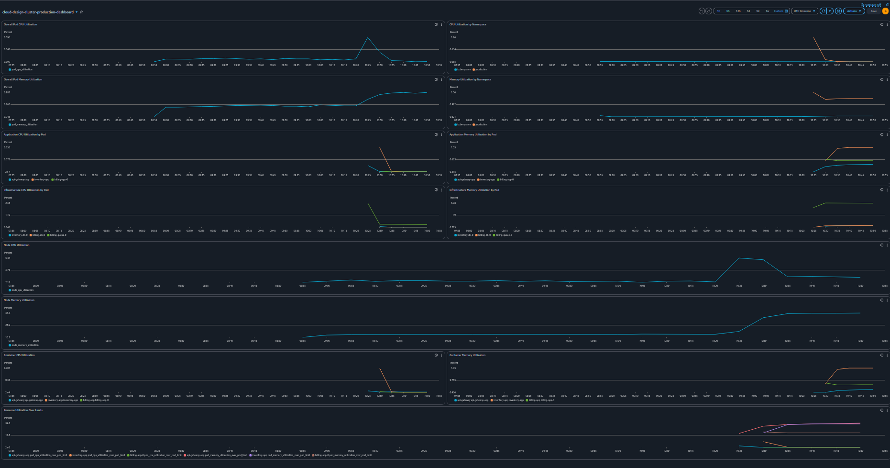

# Code Keeper

> **Project Focus**: This project demonstrates infrastructure as code using Terraform and AWS cloud services, specifically focused on deploying a microservices architecture to AWS EKS with a complete GitLab CI/CD pipeline. The primary goal is to showcase cloud infrastructure design, automated deployment, and continuous integration/delivery practices.

A cloud-native microservices architecture deployed on AWS EKS (Elastic Kubernetes Service), designed for high availability, scalability, and security, with fully automated CI/CD pipelines using self-hosted GitLab.

**Diagram of AWS resources for the production environment.**


## Table of Contents

- [Project Overview](#project-overview)
- [CI/CD Pipeline](#cicd-pipeline)
- [Deployment Status](#deployment-status)
- [Architecture Components](#architecture-components)
- [Technologies](#technologies)
- [Project Structure](#project-structure)
- [Getting Started](#getting-started)
- [CI/CD Pipeline Details](#cicd-pipeline-details)
- [API Documentation](#api-documentation)
- [Testing with Postman](#testing-with-postman)
- [Monitoring & Observability](#monitoring--observability)
- [Cleanup](#cleanup)
- [Architecture Features](#architecture-features)
- [Future Enhancements](#future-enhancements)
- [License](#license)

## Project Overview

This project implements a cloud-native movie catalog service with three microservices:

1. **API Gateway**

   - Entry point for all client requests
   - Routes requests to appropriate backend services
   - Swagger/OpenAPI documentation at `/api-docs`
   - Built with Node.js/Express

2. **Inventory Service**

   - Manages movie catalog with CRUD operations via RESTful API
   - PostgreSQL database for persistent storage
   - RESTful API endpoints

3. **Billing Service**
   - Processes orders through a message queue system
   - PostgreSQL database for order history
   - Asynchronous processing using RabbitMQ

## CI/CD Pipeline

This project features a complete GitLab CI/CD setup for automated testing, building, and deployment:

1. **Self-hosted GitLab**

   - Runs in Docker containers for easy setup and management
   - Includes GitLab Runner for executing CI/CD pipelines
   - Configured via Ansible for automated setup and maintenance

2. **Pipeline Workflows**

   - **Service Pipelines**: Each microservice has its own automated build, test, scan and deployment pipeline
   - **Infrastructure Pipeline**: Manages infrastructure changes through Terraform
   - All environment-specific variables managed securely through GitLab CI variables

3. **Automated Deployment**
   - Staging and Production environments configured via CI/CD
   - Infrastructure changes tracked and applied automatically
   - Kubernetes deployments managed through GitLab CI/CD




## Deployment Status

### Kubernetes Resources

The following image shows the running Kubernetes services and pods in staging and production environments:



### API Testing Results

Successful API test results from Postman showing the Movie CRUD operations working against the AWS ingress endpoint:

#### API test results - Staging



#### API test results - Production



## Architecture Components

### Infrastructure (AWS)

- **Separate Environments**:
  - **Staging**: Complete EKS cluster in its own VPC.
  - **Production**: Separate EKS cluster in its own VPC.
  - Each environment is completely isolated with identical architecture, but different resource configurations
- **VPC**: Custom VPC spanning multiple availability zones for each environment
- **EKS Cluster**: Managed Kubernetes with nodes in private subnets
- **Multi-AZ Setup**: Resources distributed across eu-north-1a and eu-north-1b for high availability
- **Load Balancing**: Application Load Balancer with HTTPS support
- **Security**: Private/public subnet separation with proper gateway configuration
- **Monitoring**: CloudWatch integration with comprehensive dashboard for monitoring cluster performance
- **State Management**: Terraform state in S3 with DynamoDB locking
- **Autoscaling**: Horizontal Pod Autoscaling (HPA) for stateless services based on CPU utilization

### GitLab CI/CD Implementation

- **Self-hosted GitLab**: Containerized GitLab instance for complete CI/CD control
- **GitLab Runner**: Docker-based runner for executing pipeline jobs
- **Multi-stage Pipelines**: Development, staging, and production environments
- **Environment Variables**: Stored securely in GitLab's CI/CD variables
- **Infrastructure as Code**: Terraform changes managed through CI/CD
- **Automated Testing**: Integrated testing before deployment
- **Deployment Automation**: Scripts for configuring kubectl and deploying to EKS

### Kubernetes Deployment Strategy

- **Stateless Services** (API Gateway, Inventory App):

  - Deployed as Kubernetes Deployments
  - Configured with Horizontal Pod Autoscaler (HPA)
  - Minimum of 1 replica, scaling up to 3 replicas based on 60% CPU utilization
  - Topology spread constraints to ensure pods are distributed across availability zones

- **Stateful Components** (Billing App, Billing Queue, Databases):
  - Deployed as StatefulSets to preserve state and identity
  - Persistent volume claims for data retention
  - Single replica with backup strategies

## Technologies

- **Container Orchestration**: Kubernetes via Amazon EKS
- **Infrastructure as Code**: Terraform modules for AWS resource provisioning
- **CI/CD**: Self-hosted GitLab with GitLab Runner
- **Configuration Management**: Ansible for GitLab setup and management
- **Databases**: PostgreSQL for persistent storage
- **Messaging**: RabbitMQ for asynchronous communication
- **API Documentation**: OpenAPI/Swagger
- **Languages & Frameworks**: Node.js, Express
- **Container Registry**: Docker Hub

## Project Structure

```
code-keeper/
├── ansible/                     # Ansible playbooks for GitLab setup
├── gitlab/                      # GitLab Docker configuration
├── images/                      # Architecture diagrams and screenshots
├── postman/                     # API test collections
├── src/                         # Application source code
│   ├── api-gateway/             # API Gateway service
│   ├── billing-app/             # Billing service
│   └── inventory-app/           # Inventory service
└── terraform/                   # Infrastructure as code
```

## Getting Started

### Prerequisites

- ✓ Docker and Docker Compose
- ✓ AWS CLI
- ✓ Terraform v1.11.4+
- ✓ Ansible
- ✓ kubectl
- ✓ Python3.13
- ✓ Git

### Required AWS Permissions

Before beginning the deployment, ensure your AWS user has the following IAM permissions:

```json
{
  "Version": "2012-10-17",
  "Statement": [
    {
      "Sid": "SetupIAM",
      "Effect": "Allow",
      "Action": [
        "iam:GetUser",
        "iam:CreatePolicy",
        "iam:GetPolicy",
        "iam:GetPolicyVersion",
        "iam:AttachUserPolicy",
        "iam:ListAttachedUserPolicies",
        "iam:ListPolicyVersions",
        "iam:DetachUserPolicy",
        "iam:DeletePolicy",
        "iam:DeletePolicyVersion",
        "iam:CreatePolicyVersion",
        "iam:UpdateAssumeRolePolicy",
        "iam:ListAttachedGroupPolicies",
        "iam:CreateGroup",
        "iam:GetGroup",
        "iam:DeleteGroup",
        "iam:AddUserToGroup",
        "iam:AttachGroupPolicy",
        "iam:ListGroupsForUser",
        "iam:DetachGroupPolicy",
        "iam:RemoveUserFromGroup",
        "iam:UpdateGroup",
        "iam:ListEntitiesForPolicy",
        "iam:ListPolicies"
      ],
      "Resource": "*"
    }
  ]
}
```

You can create this policy in the AWS Management Console or see the `bootstrap/initial-user-policy.json` file for a ready-to-use policy document.

### Setup Process

#### 1. Start GitLab Services

First, set up the self-hosted GitLab instance:

```bash
cd gitlab
cp .env.example .env
# Edit .env file to configure your environment variables
docker-compose up -d
```

Wait for GitLab to start (this may take a few minutes). Access the GitLab UI at http://192.168.56.10 (or your configured URL). <br>
⚠️ **Important:** Do not set the base URL as `http://localhost`. It can cause issues with container communication.

Initial password can be obtained from `config` folder:

```bash
cat config/initial_root_password
```

#### 2. Configure Ansible for GitLab Setup

Configure your GitLab API token and other variables:

```bash
cd ansible
cp group_vars/all.yml.example group_vars/all.yml
cp group_vars/vault.yml.example group_vars/vault.yml
# Edit the .yml files to add your GitLab token and other variables
```

Be sure to encrypt the `vault.yml`:

```bash
ansible-vault encrypt group_vars/vault.yml
```

#### 3. Set Up Python virtual environment for Ansible

While in `/ansible` folder, create and activate the virtual environment:

```bash
python3.13 -m venv ~/.ansible-venv
source ~/.ansible-venv/bin/activate
```

Install required dependencies:

```bash
pip install ansible python-gitlab
```

Ensure your `inventory/localhost` file contains:

```bash
[local]
localhost ansible_connection=local
```

#### 4. Set up S3 Terraform state backend

Configure and fill `tfstate` variables for backend:

```bash
cp terraform.tfvars.example terraform.tfvars
```

a. **Initialize Terraform state backend**:

```bash
cd terraform/bootstrap
terraform init
terraform apply
```

#### 5. Run the GitLab Setup Playbook

```bash
# Ensure the virtual environment is activated:
source ~/.ansible-venv/bin/activate

# Run the playbook:
ansible-playbook -i inventory/localhost gitlab_setup.yml --ask-vault-pass
```

This will:

- Create repositories for each service
- Configure CI/CD variables
- Set up webhooks and access permissions
- Initialize repositories with code and CI/CD configuration

#### 6. Use the CI/CD Pipeline to deploy everything

CI/CD will automatically deploy changes when you push to the repositories.

**You want to pause/cancel microservice pipelines and let the infrastructure pipeline run first to set everything up.**

## CI/CD Pipeline Details

### Monitoring Pipelines

Go to **Projects > Your Project > Build > Pipelines** or directly access:

```bash
<gitlab-host>/dashboard/projects/personal
```

- Click on a specific pipeline icon to view its jobs and stages. Each job displays real-time logs and status updates.
- Manual Approval Steps:
  - Identify jobs marked as manual and click to approve or deny.
  - Example: The `approval-prod` and `apply-prod` jobs require manual approval and initation after the staging deployment completes.


### Service Pipeline Stages (API Gateway, Inventory, Billing)

The project uses two distinct pipeline types

1. **Build**: Compiles the application code using Node.js, installs dependencies via npm, and runs a verification script to ensure all dependencies are installed correctly.
2. **Test**: Executes the test suite for the service.
3. **Scan**: Performs code quality analysis using tools like JShint and runs security scans (SAST) to identify potential vulnerabilities in the codebase.
4. **Containerize**: Builds Docker container images, tags them with the commit SHA and 'latest', authenticates with Docker Hub, and pushes the images to the repository.
5. **Deploy to Staging**: Configures kubectl to connect to the staging EKS cluster, creates necessary Kubernetes secrets from CI variables, and deploys the application with persistent volumes.
6. **Approval**: Adds a manual approval gate that requires explicit authorization before the production deployment can proceed.
7. **Deploy to Production**: Similar to staging deployment but targets the production EKS cluster and namespace, using production-specific environment variables and secrets.

### Infrastructure Pipeline Stages (Terraform)

1. **Init**: Initializes Terraform with the proper backend configuration for state management, dynamically generates environment-specific tfvars files, and prepares the working directory.
2. **Validate**: Performs syntax validation on Terraform files, runs `terraform fmt` to check formatting, and checks for potential hardcoded secrets in the codebase.
3. **Plan**: Creates and displays an execution plan for the staging environment infrastructure changes, showing what resources would be created, modified, or destroyed.
4. **Apply Staging**: Applies the approved plan to the staging environment, configures kubectl to connect to the EKS cluster, and creates necessary Kubernetes resources like namespaces and ingress.
5. **Approval**: Implements a manual approval gate requiring explicit authorization before any changes can be applied to the production infrastructure.
6. **Apply Production**: Plans and applies changes to the production environment, similarly configuring kubectl, setting up the production namespace, and applying ingress configurations to the production cluster.

### Repository Structure

Each service repository created by the Ansible playbook includes:

- Source code for the service
- Dockerfile for containerization
- CI/CD configuration (.gitlab-ci.yml)
- Kubernetes manifests for deployment

## API Documentation

When running, API documentation is available at `/api-docs` endpoint of the API Gateway service.

## Testing with Postman

Import the collections and environment from the `postman/` directory to test the API:

1. Import `code-keeper.postman_collection.json`
2. Import `code-keeper.postman_environment.json`
3. Update the environment variables with your deployment details

## Monitoring & Observability

The project includes a comprehensive CloudWatch dashboard that provides visibility into cluster performance:

### Staging Dashboard



### Production Dashboard



- **Overall Cluster Metrics**: Pod and node-level CPU and memory utilization across the cluster
- **Namespace Monitoring**: Separate metrics for default and kube-system namespaces
- **Application Performance**: Dedicated panels tracking CPU and memory for each microservice (API Gateway, Inventory, Billing)
- **Infrastructure Monitoring**: Specialized metrics for stateful components (databases and message queue)
- **Resource Optimization**: Tracking of resource utilization against defined limits to optimize container configurations
- **Container Insights**: AWS EKS addon enabled for deep visibility into container performance

The dashboard provides both high-level overview panels and detailed component-specific metrics, enabling quick identification of performance bottlenecks or potential issues.

## Cleanup

To clean up resources:

1. **Remove application resources**:

   Done via Infrastructure pipeline. Run `cleanup-prod` and then `cleanup-staging`. <br>Pipeline cleans up all the Kubernetes resources before using `terraform destroy`.

2. **Destroy S3 Terraform State backend**:

   While in `terraform/bootstrap` directory, run:

   ```bash
   terraform destroy
   ```

3. **Shut down GitLab**:
   ```bash
   cd gitlab
   docker-compose down
   ```

## Architecture Features

- **High Availability**: Multi-AZ deployment with automatic failover
- **Scalability**: EKS auto-scaling with configurable node groups
- **Security**: Private subnets for application pods, public-only for ingress
- **Disaster Recovery**: AZ2 configured for disaster recovery and scaling
- **HTTPS Support**: Integrated with AWS Certificate Manager using a self-signed certificate (a proper ACM certificate would be used with a registered domain name)
- **Automated Deployment**: Complete CI/CD pipeline for code and infrastructure changes
- **Self-hosted GitLab**: Full control over the CI/CD environment with Docker-based setup

## Future Enhancements

### Database Improvements

- **Migrate to Amazon RDS**: Replace StatefulSet PostgreSQL databases with Amazon RDS for improved reliability, automatic backups, and Multi-AZ deployments

### Security Enhancements

- **Custom Domain**: Register a custom domain name to replace the self-signed certificate with a properly validated AWS ACM certificate
- **Amazon CloudFront**: Add CloudFront content delivery network (CDN) for faster content delivery
- **AWS WAF Integration**: Add AWS Web Application Firewall for additional protection against common exploits

### CI/CD Improvements

- **Automated Rollbacks**: Add automated rollback capability if deployments fail
- **Extended Test Coverage**: Add performance and security testing to the CI/CD pipeline

## License

See the [LICENSE](./LICENSE) file for licensing details.
