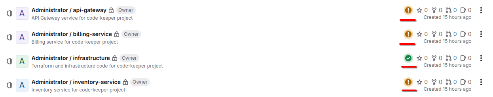

# Code Keeper

> **Project Focus**: This project demonstrates infrastructure as code using Terraform and AWS cloud services, specifically focused on deploying a microservices architecture to AWS EKS with a complete GitLab CI/CD pipeline. The primary goal is to showcase cloud infrastructure design, automated deployment, and continuous integration/delivery practices.

A cloud-native microservices architecture deployed on AWS EKS (Elastic Kubernetes Service), designed for high availability, scalability, and security, with fully automated CI/CD pipelines using self-hosted GitLab.

**Diagram of AWS resources for the production environment.**


## Table of Contents

- [Quick Start Guide](#quick-start-guide)
- [Project Overview](#project-overview)
- [Architecture](#architecture)
  - [Infrastructure Components](#infrastructure-components)
  - [Deployment Strategy](#deployment-strategy)
  - [Key Features](#key-features)
- [Setup & Installation](#setup--installation)
  - [Prerequisites](#prerequisites)
  - [AWS Permissions](#aws-permissions)
  - [Installation Steps](#installation-steps)
- [CI/CD Pipelines](#cicd-pipelines)
  - [Pipeline Structure](#pipeline-structure)
  - [Service Pipelines](#service-pipelines)
  - [Infrastructure Pipeline](#infrastructure-pipeline)
  - [Pipeline Monitoring](#pipeline-monitoring)
- [Usage & Testing](#usage--testing)
  - [API Documentation](#api-documentation)
  - [Postman Tests](#postman-tests)
  - [Deployment Status](#deployment-status)
- [Monitoring & Observability](#monitoring--observability)
- [Maintenance & Operations](#maintenance--operations)
  - [Resource Cleanup](#resource-cleanup)
  - [Common Tasks](#common-tasks)
- [Troubleshooting](#troubleshooting)
- [Future Enhancements](#future-enhancements)
- [License](#license)

## Quick Start Guide

For those who want to get started immediately:

1. **Prerequisites**: Ensure you have Docker, AWS CLI, Terraform v1.11.4+, Ansible, kubectl, Python3.13, and Git installed.

2. **Start GitLab**:

   ```bash
   cd gitlab
   cp .env.example .env
   # Edit .env file
   docker-compose up -d
   cat config/initial_root_password  # Get root password
   ```

3. **Configure & Run Ansible**:

   ```bash
   cd ansible
   cp group_vars/all.yml.example group_vars/all.yml
   cp group_vars/vault.yml.example group_vars/vault.yml
   # Edit both files
   ansible-vault encrypt group_vars/vault.yml
   python3.13 -m venv ~/.ansible-venv
   source ~/.ansible-venv/bin/activate
   pip install ansible python-gitlab
   ansible-playbook -i inventory/localhost gitlab_setup.yml --ask-vault-pass
   ```

4. **Setup Terraform**:

   ```bash
   cp terraform.tfvars.example terraform.tfvars
   cd terraform/bootstrap
   terraform init && terraform apply
   ```

5. **Run Pipelines**: Allow infrastructure pipeline to complete before running service pipelines.

## Project Overview

This project implements a cloud-native movie catalog service with three microservices:

1. **API Gateway**

   - Entry point for all client requests
   - Routes requests to appropriate backend services
   - Swagger/OpenAPI documentation at `/api-docs`
   - Built with Node.js/Express

2. **Inventory Service**

   - Manages movie catalog with CRUD operations via RESTful API
   - PostgreSQL database for persistent storage
   - RESTful API endpoints

3. **Billing Service**
   - Processes orders through a message queue system
   - PostgreSQL database for order history
   - Asynchronous processing using RabbitMQ

## Architecture

### Infrastructure Components

- **Multi-Environment Design**

  - **Staging**: Complete EKS cluster in its own VPC
  - **Production**: Separate EKS cluster in its own VPC
  - Each environment is completely isolated with identical architecture

- **AWS Services Used**

  - **VPC**: Custom VPC spanning multiple availability zones for each environment
  - **EKS**: Managed Kubernetes with nodes in private subnets
  - **Load Balancing**: Application Load Balancer with HTTPS support
  - **CloudWatch**: Comprehensive monitoring dashboards
  - **ACM**: Certificate management for HTTPS support
  - **S3/DynamoDB**: Terraform state management

- **High Availability Design**
  - **Multi-AZ Setup**: Resources distributed across eu-north-1a and eu-north-1b
  - **Private/Public Subnet Separation**: Enhanced security with proper gateway configuration
  - **Autoscaling**: Horizontal Pod Autoscaling (HPA) based on CPU utilization


### Deployment Strategy

- **Stateless Services** (API Gateway, Inventory App)

  - Deployed as Kubernetes Deployments
  - Configured with Horizontal Pod Autoscaler (HPA)
  - Minimum of 1 replica, scaling up to 3 replicas based on 60% CPU utilization
  - Topology spread constraints across availability zones

- **Stateful Components** (Billing App, Billing Queue, Databases)
  - Deployed as StatefulSets to preserve state and identity
  - Persistent volume claims for data retention
  - Single replica with backup strategies

### Key Features

- **High Availability**: Multi-AZ deployment with automatic failover
- **Scalability**: EKS auto-scaling with configurable node groups
- **Security**: Private subnets for application pods, public-only for ingress
- **Disaster Recovery**: AZ2 configured for disaster recovery and scaling
- **HTTPS Support**: Integrated with AWS Certificate Manager
- **Automated Deployment**: Complete CI/CD pipeline for code and infrastructure changes
- **Self-hosted GitLab**: Full control over the CI/CD environment with Docker-based setup

## Setup & Installation

### Prerequisites

- ✓ Docker and Docker Compose
- ✓ AWS CLI
- ✓ Terraform v1.11.4+
- ✓ Ansible
- ✓ kubectl
- ✓ Python3.13
- ✓ Git

### AWS Permissions

Before beginning the deployment, ensure your AWS user has the following IAM permissions:

```json
{
  "Version": "2012-10-17",
  "Statement": [
    {
      "Sid": "SetupIAM",
      "Effect": "Allow",
      "Action": [
        "iam:GetUser",
        "iam:CreatePolicy",
        "iam:GetPolicy",
        "iam:GetPolicyVersion",
        "iam:AttachUserPolicy",
        "iam:ListAttachedUserPolicies",
        "iam:ListPolicyVersions",
        "iam:DetachUserPolicy",
        "iam:DeletePolicy",
        "iam:DeletePolicyVersion",
        "iam:CreatePolicyVersion",
        "iam:UpdateAssumeRolePolicy",
        "iam:ListAttachedGroupPolicies",
        "iam:CreateGroup",
        "iam:GetGroup",
        "iam:DeleteGroup",
        "iam:AddUserToGroup",
        "iam:AttachGroupPolicy",
        "iam:ListGroupsForUser",
        "iam:DetachGroupPolicy",
        "iam:RemoveUserFromGroup",
        "iam:UpdateGroup",
        "iam:ListEntitiesForPolicy",
        "iam:ListPolicies"
      ],
      "Resource": "*"
    }
  ]
}
```

You can create this policy in the AWS Management Console or see the `bootstrap/initial-user-policy.json` file for a ready-to-use policy document.

### Installation Steps

#### 1. Start GitLab Services

First, set up the self-hosted GitLab instance:

```bash
cd gitlab
cp .env.example .env
# Edit .env file to configure your environment variables
docker-compose up -d
```

Wait for GitLab to start (this may take a few minutes). Access the GitLab UI at http://192.168.56.10 (or your configured URL).  
⚠️ **Important:** Do not set the base URL as `http://localhost`. It can cause issues with container communication.

Initial password can be obtained from `config` folder:

```bash
cat config/initial_root_password
```

#### 2. Configure Ansible for GitLab Setup

Configure your GitLab API token and other variables:

```bash
cd ansible
cp group_vars/all.yml.example group_vars/all.yml
cp group_vars/vault.yml.example group_vars/vault.yml
# Edit the .yml files to add your GitLab token and other variables
```

Be sure to encrypt the `vault.yml`:

```bash
ansible-vault encrypt group_vars/vault.yml
```

#### 3. Set Up Python Virtual Environment for Ansible

While in `/ansible` folder, create and activate the virtual environment:

```bash
python3.13 -m venv ~/.ansible-venv
source ~/.ansible-venv/bin/activate
```

Install required dependencies:

```bash
pip install ansible python-gitlab
```

Ensure your `inventory/localhost` file contains:

```bash
[local]
localhost ansible_connection=local
```

#### 4. Set up S3 Terraform State Backend

Configure and fill `tfstate` variables for backend:

```bash
cp terraform.tfvars.example terraform.tfvars
```

Initialize Terraform state backend:

```bash
cd terraform/bootstrap
terraform init
terraform apply
```

#### 5. Run the GitLab Setup Playbook

```bash
# Ensure the virtual environment is activated:
source ~/.ansible-venv/bin/activate

# Run the playbook:
ansible-playbook -i inventory/localhost gitlab_setup.yml --ask-vault-pass
```

This will:

- Create repositories for each service
- Configure CI/CD variables
- Set up webhooks and access permissions
- Initialize repositories with code and CI/CD configuration

#### 6. Use the CI/CD Pipeline to Deploy Everything

CI/CD will automatically deploy changes when you push to the repositories.

⚠️ **Important:** Pause/cancel microservice pipelines and let the infrastructure pipeline run first to set everything up.

## CI/CD Pipelines

### Pipeline Structure

The project uses two distinct pipeline types:

1. **Service Pipelines**: For each microservice (API Gateway, Inventory, Billing)
2. **Infrastructure Pipeline**: For managing the AWS infrastructure via Terraform


### Pipeline Monitoring

Go to **Projects > Your Project > Build > Pipelines** or directly access:

```
<gitlab-host>/dashboard/projects/personal
```

- Click on a specific pipeline icon to view its jobs and stages
- Each job displays real-time logs and status updates
- Manual Approval Steps:
  - Identify jobs marked as manual and click to run the job
  - Example: The `approval-prod` and `apply-prod` jobs require manual approval after staging deployment completes



### Service Pipelines

Each service pipeline includes the following stages:

1. **Build**: Compiles code, installs dependencies via npm, verifies installation
2. **Test**: Executes the test suite for the service
3. **Scan**: Performs code quality and security analysis
4. **Containerize**: Builds Docker images, tags them, and pushes to repository
5. **Deploy to Staging**: Configures kubectl, creates Kubernetes secrets, deploys to staging
6. **Approval**: Manual approval gate before proceeding to production
7. **Deploy to Production**: Deploys to production EKS cluster using prod-specific variables

### Infrastructure Pipeline

The infrastructure pipeline manages all AWS resources:

1. **Init**: Initializes Terraform with proper backend configuration, generates tfvars files
2. **Validate**: Syntax validation, format checking, security best practices verification
3. **Plan**: Creates execution plan for staging environment
4. **Apply Staging**: Applies the plan to staging, configures kubectl, creates Kubernetes resources
5. **Approval**: Manual approval gate for production changes
6. **Apply Production**: Plans and applies changes to production environment

## Usage & Testing

### API Documentation

When running, API documentation is available at `/api-docs` endpoint of the API Gateway service.

### Postman Tests

Import the collections and environment from the `postman/` directory to test the API:

1. Import `code-keeper.postman_collection.json`
2. Import `code-keeper.postman_environment.json`
3. Update the environment variables with your deployment details

### Deployment Status

#### Kubernetes Resources

The following image shows the running Kubernetes services and pods in staging and production environments:


#### API Testing Results

Successful API test results from Postman showing the Movie CRUD operations working against the AWS ingress endpoint:

**Staging Results:**


**Production Results:**


## Monitoring & Observability

The project includes a comprehensive CloudWatch dashboard that provides visibility into cluster performance:

**Staging Dashboard:**


**Production Dashboard:**


Key metrics available:

- **Overall Cluster Metrics**: Pod and node-level CPU and memory utilization
- **Namespace Monitoring**: Metrics for default and kube-system namespaces
- **Application Performance**: CPU and memory tracking for each microservice
- **Infrastructure Monitoring**: Metrics for databases and message queue
- **Resource Optimization**: Resource utilization against defined limits
- **Container Insights**: Deep visibility into container performance

The dashboard provides both high-level overview panels and detailed component-specific metrics, enabling quick identification of performance bottlenecks or potential issues.

## Maintenance & Operations

### Resource Cleanup

To clean up all resources when you're done:

1. **Remove application resources**:
   Done via Infrastructure pipeline. Run `cleanup-prod` and then `cleanup-staging`.  
   Pipeline cleans up all Kubernetes resources before using `terraform destroy`.

2. **Destroy S3 Terraform State backend**:

   ```bash
   cd terraform/bootstrap
   terraform destroy
   ```

3. **Shut down GitLab**:
   ```bash
   cd gitlab
   docker-compose down
   ```

### Common Tasks

#### Updating Service Configuration

1. Make changes to the service code in the corresponding repository
2. Commit and push changes
3. The CI/CD pipeline will automatically build, test, and deploy the changes

#### Scaling Resources

To scale the number of nodes or pods:

1. Edit the appropriate terraform variables in `terraform-staging.tfvars` or `terraform-production.tfvars`
2. Commit and push changes to the infrastructure repository
3. The CI/CD pipeline will apply the changes

## Troubleshooting

### Common Issues and Solutions

#### Pipeline Failures

**Issue**: CI/CD pipeline fails during deployment  
**Solution**:

- Check the job logs for specific error messages
- Verify AWS credentials are correctly configured in GitLab CI variables
- Ensure required permissions are granted to the AWS user

#### Service Connectivity Issues

**Issue**: Services cannot communicate with each other  
**Solution**:

- Verify Kubernetes service names are correctly referenced in environment variables
- Check that services are deployed in the correct namespace
- Examine network policies to ensure traffic is allowed between services

#### Database Connection Errors

**Issue**: Services cannot connect to databases  
**Solution**:

- Verify database credentials are correctly set in the Kubernetes secrets
- Check that StatefulSets are running and persistent volumes are correctly attached
- Ensure database initialization scripts have run successfully

## Project Structure

```
code-keeper/
├── ansible/                     # Ansible playbooks for GitLab setup
├── gitlab/                      # GitLab Docker configuration
├── images/                      # Architecture diagrams and screenshots
├── postman/                     # API test collections
├── src/                         # Application source code
│   ├── api-gateway/             # API Gateway service
│   ├── billing-app/             # Billing service
│   └── inventory-app/           # Inventory service
└── terraform/                   # Infrastructure as code
```

## Future Enhancements

### Database Improvements

- **Migrate to Amazon RDS**: Replace StatefulSet PostgreSQL databases with Amazon RDS for improved reliability, automatic backups, and Multi-AZ deployments

### Security Enhancements

- **Custom Domain**: Register a custom domain name to replace the self-signed certificate with a properly validated AWS ACM certificate
- **Amazon CloudFront**: Add CloudFront content delivery network (CDN) for faster content delivery
- **AWS WAF Integration**: Add AWS Web Application Firewall for additional protection against common exploits

### CI/CD Improvements

- **Automated Rollbacks**: Add automated rollback capability if deployments fail
- **Extended Test Coverage**: Add performance and security testing to the CI/CD pipeline

## License

See the [LICENSE](./LICENSE) file for licensing details.
