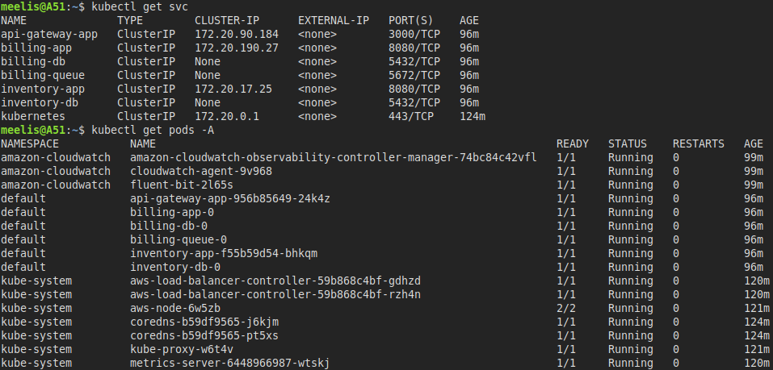
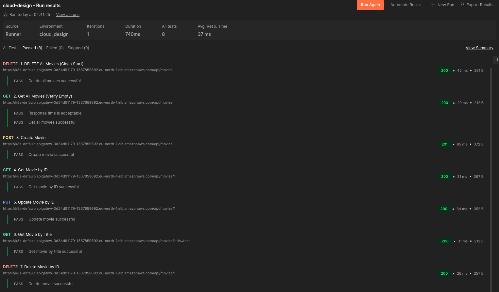

# Code Keeper

> **Project Focus**: This project demonstrates infrastructure as code using Terraform and AWS cloud services, specifically focused on deploying a microservices architecture to AWS EKS. The primary goal is to showcase cloud infrastructure design and deployment rather than local development.

A cloud-native microservices architecture deployed on AWS EKS (Elastic Kubernetes Service), designed for high availability, scalability, and security.


## Project Overview

This project implements a cloud-native movie catalog service with three microservices:

1. **API Gateway**

   - Entry point for all client requests
   - Routes requests to appropriate backend services
   - Swagger/OpenAPI documentation at `/api-docs`
   - Built with Node.js/Express

2. **Inventory Service**

   - Manages movie catalog with CRUD operations via RESTful API
   - PostgreSQL database for persistent storage
   - RESTful API endpoints

3. **Billing Service**
   - Processes orders through a message queue system
   - PostgreSQL database for order history
   - Asynchronous processing using RabbitMQ

## Deployment Status

### Kubernetes Resources

The following image shows the running Kubernetes services and pods in the cluster:



### API Testing Results

Successful API test results from Postman showing the Movie CRUD operations working against the AWS ingress endpoint:



## Architecture Components

### Infrastructure (AWS)

- **VPC**: Custom VPC (10.0.0.0/16) spanning multiple availability zones
- **EKS Cluster**: Managed Kubernetes with nodes in private subnets
- **Multi-AZ Setup**: Resources distributed across eu-north-1a and eu-north-1b for high availability
- **Load Balancing**: Application Load Balancer with HTTPS support
- **Security**: Private/public subnet separation with proper gateway configuration
- **Monitoring**: CloudWatch integration with comprehensive dashboard for monitoring cluster performance
- **State Management**: Terraform state in S3 with DynamoDB locking
- **Autoscaling**: Horizontal Pod Autoscaling (HPA) for stateless services based on CPU utilization

### Kubernetes Deployment Strategy

- **Stateless Services** (API Gateway, Inventory App):

  - Deployed as Kubernetes Deployments
  - Configured with Horizontal Pod Autoscaler (HPA)
  - Minimum of 1 replica, scaling up to 3 replicas based on 60% CPU utilization
  - Topology spread constraints to ensure pods are distributed across availability zones

- **Stateful Components** (Billing App, Billing Queue, Databases):
  - Deployed as StatefulSets to preserve state and identity
  - Persistent volume claims for data retention
  - Single replica with backup strategies

## Technologies

- **Container Orchestration**: Kubernetes via Amazon EKS
- **Infrastructure as Code**: Terraform modules for AWS resource provisioning
- **Databases**: PostgreSQL for persistent storage
- **Messaging**: RabbitMQ for asynchronous communication
- **API Documentation**: OpenAPI/Swagger
- **Languages & Frameworks**: Node.js, Express
- **Container Registry**: Docker Hub

## Project Structure

```
cloud-design/
├── docker-compose.yaml         # Docker configuration reference
├── kustomization.yaml          # Kubernetes resource management
├── Dockerfiles/                # Docker build configurations
├── images/                     # Architecture diagrams
├── manifests/                  # Kubernetes manifests
│   ├── api-gateway-app.yaml
│   ├── billing-app.yaml
│   ├── billing-db.yaml
│   ├── billing-queue.yaml
│   ├── inventory-app.yaml
│   ├── inventory-db.yaml
│   └── networking/
│       └── api-gateway-ingress.tpl.yaml
├── postman/                    # API test collections
├── scripts/                    # Utility scripts
│   ├── build-and-push.sh
│   ├── cleanup-k8s-resources.sh
│   ├── configure-kubectl-helm.sh
│   ├── init-billing-db.sh
│   └── init-inventory-db.sh
├── src/                        # Application source code
│   ├── api-gateway/            # API Gateway service
│   ├── billing-app/            # Billing service
│   └── inventory-app/          # Inventory service
└── terraform/                  # Infrastructure as code
    ├── acm/                    # Certificate management
    ├── bootstrap/              # Terraform state setup
    ├── cloudwatch/             # Monitoring
    ├── eks/                    # Kubernetes cluster
    ├── iam/                    # Identity & access
    ├── kubernetes-addons/      # K8s addons (ALB, metrics)
    └── vpc/                    # Network configuration
```

## Getting Started

### Prerequisites

- AWS CLI configured with appropriate permissions
- Terraform v1.11.4+
- kubectl
- Helm v3

### Required AWS Permissions

Before beginning the deployment, ensure your AWS user has the following IAM permissions:

```json
{
  "Version": "2012-10-17",
  "Statement": [
    {
      "Sid": "SetupIAM",
      "Effect": "Allow",
      "Action": [
        "iam:GetUser",
        "iam:CreatePolicy",
        "iam:GetPolicy",
        "iam:GetPolicyVersion",
        "iam:AttachUserPolicy",
        "iam:ListAttachedUserPolicies",
        "iam:ListPolicyVersions",
        "iam:DetachUserPolicy",
        "iam:DeletePolicy",
        "iam:DeletePolicyVersion",
        "iam:CreatePolicyVersion",
        "iam:UpdateAssumeRolePolicy",
        "iam:ListAttachedGroupPolicies",
        "iam:CreateGroup",
        "iam:GetGroup",
        "iam:DeleteGroup",
        "iam:AddUserToGroup",
        "iam:AttachGroupPolicy",
        "iam:ListGroupsForUser",
        "iam:DetachGroupPolicy",
        "iam:RemoveUserFromGroup",
        "iam:UpdateGroup",
        "iam:ListEntitiesForPolicy",
        "iam:ListPolicies"
      ],
      "Resource": "*"
    }
  ]
}
```

You can create this policy in the AWS Management Console or see the `bootstrap/initial-user-policy.json` file for a ready-to-use policy document.

### Setup Infrastructure

- Rename `/terraform/terraform.tfvars.example` to `/terraform/terraform.tfvars` and fill it with information.
- For testing, `t3.medium` instance can be used. It allows just enough pods to run the project on minimum load. `t3.large` is needed for full load.

1. **Initialize Terraform state backend**:

   ```bash
   cd terraform/bootstrap
   terraform init
   terraform apply
   ```

2. **Deploy main infrastructure**:

   ```bash
   cd ..
   terraform init
   terraform apply
   ```

3. **Configure kubectl and Helm**:

   ```bash
   cd ..
   ./scripts/configure-kubectl-helm.sh
   ```

4. **Deploy application**:
   ```bash
   kubectl apply -k .
   ```

## API Documentation

When running, API documentation is available at `/api-docs` endpoint of the API Gateway service.

## Testing with Postman

Import the collections and environment from the `postman/` directory to test the API:

1. Import `cloud-design.postman_collection.json`
2. Import `cloud_design.postman_environment.json`
3. Update the environment variables with your deployment details

## Cleanup

To clean up resources:

1. **Remove application resources**:

   ```bash
   ./scripts/cleanup-k8s-resources.sh
   ```

2. **Destroy infrastructure**:
   ```bash
   cd terraform
   terraform destroy
   cd bootstrap
   terraform destroy
   ```

## Architecture Features

- **High Availability**: Multi-AZ deployment with automatic failover
- **Scalability**: EKS auto-scaling with configurable node groups
- **Security**: Private subnets for application pods, public-only for ingress
- **Disaster Recovery**: AZ2 configured for disaster recovery and scaling
- **HTTPS Support**: Integrated with AWS Certificate Manager using a self-signed certificate (a proper ACM certificate would be used with a registered domain name)

### Monitoring & Observability

The project includes a comprehensive CloudWatch dashboard that provides visibility into cluster performance:


- **Overall Cluster Metrics**: Pod and node-level CPU and memory utilization across the cluster
- **Namespace Monitoring**: Separate metrics for default and kube-system namespaces
- **Application Performance**: Dedicated panels tracking CPU and memory for each microservice (API Gateway, Inventory, Billing)
- **Infrastructure Monitoring**: Specialized metrics for stateful components (databases and message queue)
- **Resource Optimization**: Tracking of resource utilization against defined limits to optimize container configurations
- **Container Insights**: AWS EKS addon enabled for deep visibility into container performance

The dashboard provides both high-level overview panels and detailed component-specific metrics, enabling quick identification of performance bottlenecks or potential issues.

## Future Enhancements

### Database Improvements

- **Migrate to Amazon RDS**: Replace StatefulSet PostgreSQL databases with Amazon RDS for improved reliability, automatic backups, and Multi-AZ deployments

### Security Enhancements

- **Custom Domain**: Register a custom domain name to replace the self-signed certificate with a properly validated AWS ACM certificate
- **Amazon CloudFront**: I would also add CloudFront content delivery network (CDN) for faster content delivery.
- **AWS WAF Integration**: Add AWS Web Application Firewall for additional protection against common exploits
- **Secret Management**: Migrate from Kubernetes Secrets to AWS Secrets Manager or HashiCorp Vault

## License

See the [LICENSE](./LICENSE) file for licensing details.
